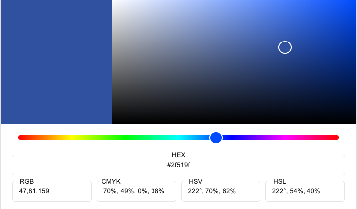
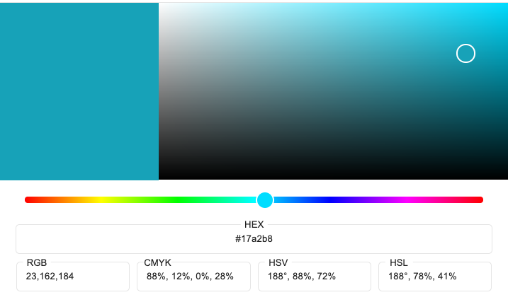

# Full Stack Frameworks Project | Code Institute | Software development Diploma

## Introduction

This is final project for the Full Stack Developer Course and is a culmination of all the modules and additional learning that was required to achieve the purpose (and some).

What is [Esse](https://esse-app.herokuapp.com/) and why?

The idea for Esse came out of a frustration and a need to solve an irk. I have a daughter who lives 6000 miles away, who got married during lockdown; an event that I had anticipated for over a year and that I could not attend. Sharing the wedding photos on WhatsApp and Facebook wasn’t ideal from a family perspective and I felt that we had a need for a 'private social media', in which we can upload our photos to albums and any family member can go and view them at will. No need to go scrolling through an endless amount of feed and no need to download all the pics to our phones.

Esse will allow uploading of videos in the next sprint and have a calendar for sharing events with family and a post page to share a broadcast about something relevant to family and friends - anything you would want to tell the whole family.

However, Esse has been developed for close friends too and so the aim was for it to extend to suit a close network or family. A certain member may wish to have someone in their family list but unlike friendships, family relationships are nonreciprocal; each user must add a friend to their family list and when a user is removed from a list, they revert back to friends. Removal of friends, again, is reciprocal.

### Table of Contents

1. [UX](#ux)

   - [Goals](#goals)

     - [Project Goals](#project-goals)
     - [Target Audience](#target-audience)
     - [User Goals](#user-goals)
     - [Future Goals](#future-goals)

   - [User Stories](#user-stories)

     - [Visitor Stories](#visitor-stories)
     - [User Stories by Type](#user-stories-by-type)

   - [Design](#design)

     - [User Interface](#user-interface)
     - [Wireframes](#wireframes)
     - [Database Design](#database-design)
     - [Model Architecture](#model-architecture)

2. [Features](#features)

   - [Existing Features](#existing-features)
   - [Future Features](#future-features-to-implement)

3. [Technologies Used](#technologies-used)

   - [Languages](#languages)
   - [Frameworks/libraries](#frameworks/libraries)
   - [Database](#database)
   - [Development and Hosting Tools](#development/hosting)

4. [Testing](#testing)

5. [Deployment](#deployment)

   - [Local](#local-setup)
     - [Prerequisites](#prerequisites)
     - [Procedure](#procedure)
   - [Heroku](#deployment-on-heroku)
     - [Requirements](#requirements)

6. [Credits](#credits)

7. [Acknowledgements](#acknowledgements)

8. [Resources](#resources)

9. [Other Notes](#other-notes)
   - [Next Steps](#next-steps)
   - [Personal Takeways](#personal-takeawys)

## UX

### Project Goals

- Create a project plan that outlines my project idea and the elements required to complete it.
- Learn additional material based on the above and develop a deeper understanding of the material already covered in the course.
- Understand the process of developing a Django app in a Docker container and then implement it.
- Develop an application that is easy to use and meets the needs of the target audience and one which is aesthetically pleasing and intuitive to all users/visitors.
- Purposefully implement a database design suitable for the application.
- Produce a project that meets the requirements of the Milestone project criteria.
- Produce a project that I am proud of.

While I was unable to work on my project due to familial circumstances and COVID, I spent a lot of time reading (and watching) in the hope that I would be able to emerge with a working project as I had no idea of how I would code some of the functionality and also, I added Docker into the mix as originally I had believed it would be necessary, based on conversations with my mentor during my initial session. I have appreciated the encouragement and support for going the extra distance I have received from him.

### Target Audience

- Anyone that wants to create a personal network of friends and family to share memories with them via digital media that is kept in organised albums

### User Goals

- to be able to upload and name my photos
- to know who my friends and family member are
- be able to share my digital media and store it
- to be able to let my friends and family know about the site
- to be able to view my friend's digital media

### Future Goals

- I would like to continue developing and improving this project to a higher standard of design and layout and add the additional features that would be useful for using the site.

- I would like to turn it into a Progressive Web App so that it works even when the app is closed and can utilize features such as push notifications and taking advantage of service worker caching to improve page loading. I first need to understand the term properly and then learn how to implement the features. Doing so- will greatly improve user experience.

### User Stories

#### Visitor Stories

As a new visitor I want/need:

- to be able to understand the purpose of the site before I sign up
- to know how my data is used
- to be able to create an account securely

#### User Stories by Type

As a registered user I want/need:

- to be able to login and logout
- to be able to update my details
- to be able to change or reset my password
- to be able view and edit my profile
- to be able to send and accept friend requests
- to be able to cancel and delete friend requests
- to be able to delete friends
- to be able to add friends to my family or remove them
- to be able to search for users
- to be able to send invitations to potential users and let them know I want to share my albums with them
- to be able to view friends/family profiles
- to be able to create a public/private portfolio/album to upload my media to
- to be able to delete my albums or media
- to be able to share my portfolio albums and assets with my family and friends
- to be able to view friends and family albums
- to receive feedback on the actions I take particularly when submitting forms and editing my account or profile and uploading media
- to be confident that my media is securely stored
- to be able to navigate the site with ease and not have to use the browser refresh button to do so

As an administrator I want/need:

- to be able to login to the admin panel and perform administrative task
- to be able to receive feedback from users

As the site owner I want/need:

- to be able to provide users with a positive and secure experience when using the site
  - through a consistent and intuitive interface
  - through a simplified navigation
  - through the familiarity of icons and actions
  - by optimised page loading
  - by providing feedback on the actions they take
  - by ensuring the site follows Django security best practices as expressed in the [documentation](https://docs.djangoproject.com/en/3.1/topics/security/)
    to enjoy all the benefits of the site as per a registered user or visitor

As a student/developer I endeavoured:

- to demonstrate my growth as a result of taking the course
- to demonstrate that I can and do use external sources to further enhance what I have learned from the course material
- to effectively use source control to preserve my work
- to try new things and push beyond my comfort zone
- to be able to solve the problems I encounter within the development lifecycle
- to follow SEO best practices (slugs and metadata)
- to develop my projects using best practices
- to maintain a list of resources used in the learning and development of the project

## Features

The main feature that I wanted to provide was the ability to share and upload media to be viewed in a way that is accessible not only the owner but also to their family and friends. To simulate the old physical family photo albums that seem to be becoming extinct due to ease of snapping and recording digitally but to leverage the benefit of the digital technologies. Those albums were genrally quite personal and share mostly with family and close friends.

### Existing Features

1. Friend requests
2. Finding friends of friends
3. Adding friends to family
4. View friend and family lists
5. Search for users by username
6. Uploading of photos to albums
7. Sending email invitations
8. Profile pages
9. Portfolio (Album) pages
10. Donations (with test keys that could be updated in future)
    - to test donations:
      - Card number: 4242 4242 4242 4242
      - CVC: 3 digits
      - Expiry: any future date
      - ZIP: any

Users' albums are separated in respect of privacy so 'family' will see all while 'friends' will only the public ones.

In line with the purpose, a random list of users is not generated in the Find Friends feature. Suggestions are based only from friends lists and for that reason, an email invite was added so that users can invite the people they would share their albums with and vice versa.

Rather than a membership or subscription service, it felt more appropriate to have a donations page. I have used Cloudinary for the media storage, where there is a certain amount of free monthly credits and additional credits are added for sharing on social media. From that endeavour, I have more than doubled the free credits and through all tests done for uploading and transformations, I hardly dented the allowance, therefore I know the amount to be sufficient at the moment.

Furthermore, since the app is still in a primitive or beta state and currently serving a personal need with nothing to incur a cost, there is no legitimate reason add a subscription fee to use any features.

### Future Features to Implement

1. Uploading of video’s and other documents
2. Sharing a link to a particular image or video with anonymous users via email
3. Following system to track when friends upload new media
4. Post app (that would be more appropriately named messages but can’t be due to a conflict with Django messages framework) to send notifications to friends and family
5. Calendar to schedule family or group events (Django Calendar)
6. Social login will be added in the next sprint

## Design

### UI

The user interface design aimed to be minimalistic and fresh since the site focused on displaying images.
The images for the albums are uploaded in their original dimensions and size to preserve them. Delivery is in the best format and quality for each users device thanks to Cloudinary's technology allowing for faster page loading. There are many add-on's that are determined in the upload preset settings of my Cloudinary account to ensure the integrity and reputation of the site will not be jeopardised by user uploads.

Tooltips on the buttons provide additional guidance and I have also used bootstraps stretched links to make the clickable area wider on profile cards.

The side navigation is custom and also uses icons for representation around the site.

I used a 2vw unit for the body font size and rems throughout so that I could have fluid typography. I need to review this in the next sprint.

### Colour scheme

The colour design is 2 colours, a primary and a secondary accent colour used for hover on links. In addition to those, bootstrap colours differentiate the purpose of 'friend action buttons' to guide the users into familiarity. This concept may need to be reviewed and I am waiting on user feedback.

The main colours are:  
  

### Logo

I used Adobe Illustrator to create the logo for the site using the same font as I used for the headings and titles as well as the primary colour. The Esse image overlay on the about page was also created with illustrator.

### Favicon

I used a favicon generator from the logo and the link is listed under resources.

### Typography

I used 2 google fonts throughout, Bilbo and Muli. Bilbo is an elaborate cursive font that I used for headings and titles and Muli was the font used in large blocks of text.

### Layout

The layout attempts to feel uncluttered but I will definitely be improving some layout decisions. I had a time issue so I rather focused on getting functionality working although I had hoped to spend more time on improvements.

### Wireframes

The wireframes are very basic. My design skills need some serious work but they did help me visualise how I would implement the features.

### Database Schema

I used a database design tool initially to figure out how the attributes and data types for the models however I no longer have access without paying so I have not been able to include the image here.

### Model Architecture

1. Custom User
   - based on Dango's [documentation](https://docs.djangoproject.com/en/3.1/topics/auth/customizing/#using-a-custom-user-model-when-starting-a-project) I extended the User model "If you’re starting a new project, it’s highly recommended to set up a custom user model, even if the default User model is sufficient for you. This model behaves identically to the default user model, but you’ll be able to customize it in the future if the need arises."
2. Profiles app
   2a. Profile
   2b. FriendRequest
3. Albums app
   3a. Album
   3b. Asset
4. Dango Rest Framework
   - With the idea of allowing registered users to grant access to their media to non-registered users, I followed a tutorial in the DRF documentation in the hopes of implementing it as a feature. So far I haven't been able to achieve it because I didn't fully grasp how make it work. I have left it in though, as I am determined to revisit the idea after the project has been assessed. I want to eliminate barriers for sharing as that is the purpose of the site.

## Technologies Used

### Languages

[Python 3.8](https://www.python.org/) A python image pulled from the Docker Hub was used inside a Docker container.

### Frameworks

[Django 3.1](https://www.djangoproject.com/) A high-level Python Web framework that encourages rapid development and clean, pragmatic design.  
[Bootstrap](https://getbootstrap.com/docs/4.5/getting-started/introduction/)

### Libraries/Packages

[Psycopg2-binary](https://pypi.org/project/psycopg2-binary/) psycopg2 - Python-PostgreSQL Database Adapter (for development)  
[environs with django suppoort](https://pypi.org/project/environs/#usage-with-django) for separation and parsing of environment variables which installs [dj-database-url](https://pypi.org/project/dj-database-url/) as a dependency.  
[Django-Crispy-forms](https://pypi.org/project/django-crispy-forms/) prestyled bootstrap forms  
[Django-allauth](https://pypi.org/project/django-allauth/)  
[Font Awesome 5](https://fontawesome.com/)

### Database

[Postgresql 12](https://www.postgresql.org/) Open source database used from conception to deployment as a container pulled from Docker Hub.

### Development/Hosting

[Visual Studio Code](https://code.visualstudio.com/) As with all my projects, VS Code is my preferred code editor.  
[autopep8 extension](https://marketplace.visualstudio.com/items?itemName=himanoa.Python-autopep8)  
[pipenv](https://pypi.org/project/pipenv/) Python recommended dependency manager.  
[Docker](www.docker.com) To containerize the app environment.  
[Docker extension](https://marketplace.visualstudio.com/items?itemName=ms-azuretools.vscode-docker) to manage (view) the docker containers.  
[Git](https://git-scm.com/) For version control.  
[GitHub](https://github.com/) To store the repository and share the code remotely.  
[Heroku](https://www.heroku.com/) Cloud platform as a service to deploy the app.

## Testing

Coverage.py is being used to check the code being tested or more specifically to find missing tests or code/modules not included in addition to the test module and TestCase and SimpleTestCase classes.

Thanks to Adam Johnson and this blog post [Getting a Django Application to 100% Coverage](https://adamj.eu/tech/2019/04/30/getting-a-django-application-to-100-percent-coverage/) I was able to resolve coverage reporting 98% to 100% by including the code in manage.py which is a workaround for a bug in the report. See screenshots [here] and refer to the credit code in manaage.py. \*\*\* apologies for not adding the screenshots at the time of writing. I will include them if I can find them.

EDIT: There is no longer 100% coverage. I eventually found that I was no longer able use the time to write the additional tests but I have done manual tests. I will add additional written tests to get the test coverage back up before this site is shared with anyone to use.

### Bugs found/fixed

During manual testing I found that within the Find friends feature a family member was showing up as the logic did not include it as adding family had not been coded when the Find friends feature was added. I have since added in the logic and tested locally. I will add a comment after testing on the live site.

After adding the user_detail view, the user_albums and album-assets view allowing users to view their friends portfolio the url for the album_detail view was resolving to user_albums instead meaning that a user would not be able to add images. This has been fixed. There has since been discovered the same problem with the album_asset url resolving instead of the asset_detail view preventing users from deleting their images, which needs to be fixed. A note will be added once done.

The email_invite_message is not receiving the name variable and I have not been able to work out how to fix that. In addition the users comment is no longer being added to the email body, whoch I will try to fix before submission but the email message will be amended to remvove the blank space representing the name variable of the user sending the invite.

The Esse.svg logo was not displaying correctly on devices that did not have the font loaded, therefore I changd it to a png file.

Account confirmation and forgotton password emails were not following the site styling and have been corrected.

Much of the time in development was spent within chrome dev tool to test responsiveness between device sizes and media queries added and then removed. As mentioned previously, I need to further improve how the site renders on different screen sizes but it has been tested from a 4k screen the smallest mobile screen and changed to improve the appearance across them all.

After added the custom error pages and about page with an error in the live site I have discovered that the custom 500 error page isn't rendering. I will attempt to fix both and leave a comment if so.

Running collectstatic again has not resolved the custom error page not rendering but going to a page that doesn't exist renders the 404 error page.
Edit: The about page error has been fixed so I cannot see if the 500 page is working now. but as there are no more broken links found thus far it is possible I will not find out before submitting.

A missing curly bracket on the get_absolute_url link from the profile.html to the album_detail.html has been resolved. Not sure how it went missing but it was found and fixed.

A login with staff status has been created to use for assessment:
username: testuser
email: testuser@email.com
password: testpass123

## Deployment

This project as aforementioned is version controlled in [Github](https://github.com/sph73) and deployed on Heroku. All sensitive data is excluded from verison control and saved in a docker-compose.yml that was used to build and run the docker container. They have also been added to the Heroku settings config vars.

I used many different branches to develop the project which has served to ensure development continued safely and then merged into the main branch after testing. Without the branches, I would have probably broken the project whilst trying to resolve a serious issue that had me panicked.

I have used the following for deployment:

- whitenoise to serve the static files, adding it to the project Middleware in `settings.py`,
- gunicorn for the webserver (both localy and live) adding it to the `heroku.yml`, `docker-compose.yml` as well as the `Dockerfile`.
- Cloudinary storages to serve the user media uploads

In order to deploy this project's with its Docker containers, I used a `heroku.yml` file instead of a `Procfile` and set the stack to use the containers after provisioning the heroku postgres addon and temporarily adding the database url to the `settings.py` file to migrate the tables.

Also, as I use Pipenv to create my virtual environments, a requirements.txt file is not required by Heroku to install the dependencies as the Pipfile and Pipfile.lock are used.

After the above configurations were complete, I used the Heroku CLI to push to the remote repository.

Once a successful build and deployment took place, I enabled automatic deploys in the settings tab on Heroku to deploy from the main branch of the Github remote repository, which ensures the live site is kept up to date with further development, so after each merge into the `main` branch the live site rebuilds.

Before attempting the initial deployment I ran Django's management command `/.manage.py deploy --check` and followed the [checklist](https://docs.djangoproject.com/en/3.1/howto/deployment/checklist/). Unfortunately, doing so resulted in the session cookie not being stored and prevented access to the site from perpetual redirect back to the home page. As I was running out of time, I removed all the added settings once I had found the cause of the problem and have left them off for now, as I am racing against an approaching deadline and it's not included in the project criteria. I will try to add them again after my project has been assessed as this was something I had included in my user stories.

### Cloning the repository

To clone this respository:

1. Create a project directory on your machine in your terminal or IDE using `mkdir <filename> && cd <filename>`
2. use pipenv to create a virtual environement or swap it with your method of choice
3. to activate the virtual environemnt use `pipenv shell` or your chosen method
4. Go the the [respository](https://github.com/SPH73/esse-app) and click on the Code button with the down arrow to either copy the url or download the zip. Ensure that you are in the relevant folder and either open the downloaded file or use `git clone https://github.com/SPH73/esse-app`
5. Install the project requirements using `pipenv install requirements.txt`
6. Check the installation with `python manage.py runserver` to confirm that Django installed correctly. If not the dependencies can be installed individually.
7. Create a .env file and add it to .gitignore with `echo .env >> .gitignore`
8. Add your environment variables to the env and reference then in the `settings.py`
9. Create a remote repository and add your push your local repository using `git add .`, `git commit -m 'Initial commit'` and `git push <your remote repository url>`
10. Your all set to go!

This repository has not been added to Docker Hub because I haven't got a public account, otherwise it could be downloaded as an image to a Dockerfile and built and run with a docker-compose.yml in development.

## Credits

Credit to [Zac Kwan](https://medium.com/@Zaccc123) and [this blog](https://medium.com/@Zaccc123/django-tests-with-nose-and-coverage-dff5d3633b4b) for the additional line of code in manage.py to generate a coverage html report automatically.

[Gerlad Altmann on pixabay](https://pixabay.com/users/geralt-9301/?utm_source=link-attribution&utm_medium=referral&utm_campaign=image&utm_content=3149988)
[About image by Gerlad Altmann on pixabay](https://pixabay.com/photos/mobile-phone-smartphone-keyboard-1917737/)
[Image by Gerlad Altmann on pixabay](https://pixabay.com/photos/personal-network-smartphone-hand-3149988/)
[Hero image by Gerlad Altmann on pixabay](https://pixabay.com/photos/iphone-ios-iphoto-smartphone-smart-1055371/)
[Privacy policy](https://app.termsfeed.com/)

## Acknowledgements

Special thanks to my mentor as always for encouraging me to push but at the same time supporting my absence when I was not able to work on the projects.
Thanks to both Tim Nelson and Chris Zielinski for helping me debug an issue with NoReverseMatch errors (they were not obvious and I don't think I woudld have solved themon my own.)

I need to mention my son, Nathan, who is 8 and has been amazing in understanding and supporting my absence both during care of my daugter and when returning to work on the project. I know I would not have reached the finish line otherwise. I look forward having the luxury of spending unhurried time with you again, my darling.

Thank you to the Code Institute content creaators for providing a course that was challenging and helped me reach this point and hopefully before too long a new career path and to the tutors that have helped me along the way.

Finally, to all the amazing YouTube content creators, contrinutors to StackOverflow and Slack, to all the bloggers that write tutorials to Nigel Poulton who produced 'Docker Deep Dive Zero to Docker in a single book' and William S Vincent for the blog tutorials and 'Django for Professionals'.

### Resources

This is my list of resources (not exhaustive) that I used either as tools to develop or for learning.

[Docker](https://docs.docker.com/compose/django/)  
[Django source code](https://github.com/django/django)  
[Django Docs](https://www.djangoproject.com/)  
[Django packages](https://djangopackages.org/)  
[Postgresql Docs](https://postgresapp.com/documentation/)

[Django REST framework](https://www.django-rest-framework.org/api-guide/generic-views/#concrete-view-classes)

[CustomUser](https://docs.djangoproject.com/en/3.1/topics/auth/customizing/#using-a-custom-user-model-when-starting-a-project)  
[Django-allauth](https://readthedocs.org/projects/django-allauth/)  
[Allauth Social login - Google](https://django-allauth.readthedocs.io/en/latest/providers.html#google)

[Cloudinary Dashboard](https://cloudinary.com/console/)  
[Cloudinary Django SDK](https://cloudinary.com/documentation/django_image_and_video_upload)  
[Cloudinary Django Library](https://github.com/cloudinary/pycloudinary)  
[Cloudinary images](https://cloudinary.com/blog/user_generated_content_part_2_images_and_their_transformations)  
[Clouindary videos](https://cloudinary.com/blog/user_generated_content_part_3_videos_and_their_transformations)  
[cloudinary-Heroku](https://devcenter.heroku.com/articles/cloudinary)  
[Django Cloudinary Storage](https://github.com/klis87/django-cloudinary-storage)

[Bootstrap Grid ref](https://getbootstrap.com/docs/4.5/layout/grid/)  
[Bootstrap Icons](https://icons.getbootstrap.com/)

[Django Tests](https://docs.djangoproject.com/en/3.1/topics/testing/)  
[Django SerializeMixin](https://docs.djangoproject.com/en/3.1/topics/testing/advanced/#testing-reusable-applications)  
[coverage.py docs](https://coverage.readthedocs.io/en/coverage-5.2.1/cmd.html)  
[Testing with Coverage](https://devguide.python.org/coverage/#using-coverage-py)  
[Adam Johnson Blog on coverage](https://adamj.eu/tech/2019/04/30/getting-a-django-application-to-100-percent-coverage/#:~:text=Code%20coverage%20is%20a%20simple,tool%20for%20measuring%20code%20coverage.)

[Learn Django Tutorials](https://learndjango.com/tutorials/)  
[UUID as Prinary ID](https://tech.serhatteker.com/post/2020-01/uuid-primary-key/#:~:text=In%20Django%20whenever%20we%20create,was%20added%20in%20Django%201.8%20.)

[ArrayField](https://docs.djangoproject.com/en/3.1/ref/contrib/postgres/fields/)

[Django Lifecycle](https://rsinger86.github.io/django-lifecycle/)

#### Next Steps

There is a lot to do still and much improvement that can be made, particulary from a design perspective so this is a project that I will use to continue my learning journey with.

I have really come to enjoy Django and with so much to learn I look forrward to getting deeper into more advanced concepts.
